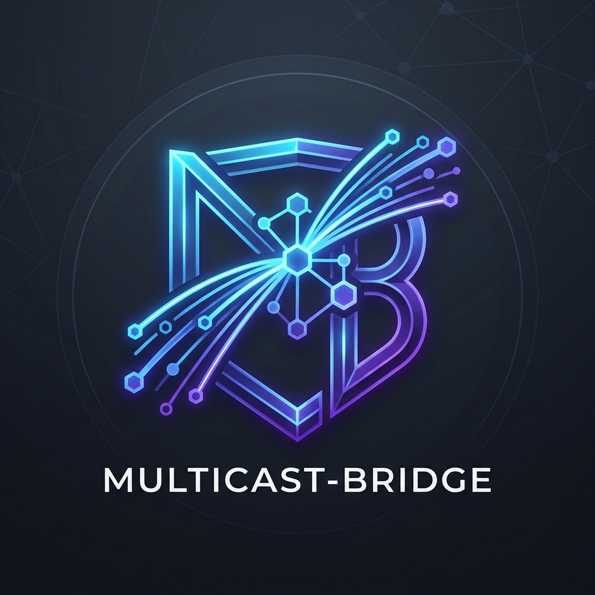

<p align="center">
  
</p>

# Multicast-Bridge (v0.9.0)

`multicast-bridge` is a high-performance, secure UDP Multicast tunneling and forwarding tool written in Go. It enables forwarding UDP multicast streams across different networks/locations using a reliable, secure unicast bridge, and reconstructs/re-emits them back as multicast at the target site.

---

## Key Features

- **High-Precision Statistics**: Dynamic throughput monitoring (sliding window), latency metrics (with moving average of last 100 packets), and packet loss rate tracking.
- **Robust Error Handling**: Strict 10-step startup sequence validation with detailed diagnostic logs and error codes (`[101]` to `[403]`).
- **Encrypt-then-FEC Design**: High-grade AES-GCM data encryption (PBKDF2 key derivation) integrated with Reed-Solomon Forward Error Correction (FEC) to guarantee security and packet recovery under lossy network conditions.
- **Cross-Platform Support**: Tailored support for both **Windows** (including Firewall configurations) and **Linux** (PID file management, graceful shutdown, and native systemd service template).
- **Flexible Management**: Configuration via rich YAML files or command-line arguments.

---

## 1. Quick Start

### Build the Binary
```bash
go build -o multicast-bridge main.go
```

### Run in Loopback Test Mode
To test the bridging loopback functionality locally on a single machine:
```bash
# Terminal 1: Run the receiver on localhost accepting data on port 5101
./multicast-bridge recv --loopback --sender 127.0.0.1:5100 --multicast 239.0.0.1:5004

# Terminal 2: Run the sender to generate and forward dummy packets to 127.0.0.1:5101
./multicast-bridge send --loopback --target 127.0.0.1:5101 --interface 127.0.0.1
```

---

## 2. Configuration & Execution

You can configure the sender and receiver using YAML configuration files.

> **⚠️ Security Notice**: Configuration files may contain a plaintext passphrase. **Do not commit them to a public repository.** Template files (`*.yaml.example`) are provided in the `config/` directory — copy them and edit locally:
> ```bash
> cp config/send.yaml.example config/send.yaml
> cp config/recv.yaml.example config/recv.yaml
> ```

### Sender Configuration (`send.yaml`)
```yaml
multicast:
  address: "239.0.0.1"      # Multicast Group Address to listen to
  port: 5004                # Multicast Port
  interface: "eth0"         # Network Interface name or local IP (e.g. 192.168.1.10)

unicast:
  control_port: 5100        # Unicast control plane port
  data_port: 5101           # Unicast data transmission port
  max_sessions: 8           # Maximum number of active receiver sessions

keepalive:
  interval: 1               # Keep-alive transmission interval in seconds

fec:
  enabled: true             # Enable Reed-Solomon FEC
  k: 8                      # FEC Data blocks
  n: 10                     # FEC Total blocks (k data + (n-k) parity)

encryption:
  enabled: true             # Enable GCM encryption & challenge-response auth
  passphrase: "your-passphrase-here"  # ⚠️ Stored as plaintext. Do not commit this file.

log:
  level: "INFO"             # DEBUG, INFO, WARN, ERROR
  file: "send.log"          # Log output file

stats_interval: 10          # Statistics logging interval in seconds (Windows only)
```

Run the sender:
```bash
./multicast-bridge send --config send.yaml
```

### Receiver Configuration (`recv.yaml`)
```yaml
sender:
  address: "192.168.1.10"   # Sender's unicast IP address
  control_port: 5100        # Sender's control port
  data_port: 5101           # Local port to bind and receive unicast data from sender

multicast:
  address: "239.0.0.1"      # Multicast Group Address to re-send to
  port: 5004                # Target Multicast Port
  interface: "eth1"         # Output interface name or local IP (e.g. 10.0.0.5)

keepalive:
  interval: 1               # Keep-alive transmission interval in seconds

fec:
  enabled: true             # Enable FEC decoding

encryption:
  enabled: true             # Enable GCM decryption
  passphrase: "your-passphrase-here"  # ⚠️ Stored as plaintext. Do not commit this file.

log:
  level: "INFO"             # DEBUG, INFO, WARN, ERROR
  file: "recv.log"          # Log output file

stats_interval: 10          # Statistics logging interval in seconds (Windows only)
```

Run the receiver:
```bash
./multicast-bridge recv --config recv.yaml
```

---

## 3. Strict 10-Step Startup Checklist & Error Codes

During the startup sequence, `multicast-bridge` strictly executes 10 sequential checks to verify environment stability. If any step fails, the system logs the issue with a specific code and exits immediately.

| Step | Check Target | Failure Code | Description & Solution |
| :--- | :--- | :---: | :--- |
| **1** | Configuration Existence | `[201]` | Configuration file not found. Verify the file path passed to `--config`. |
| **2** | Value Validation | `[202]` | Invalid configuration parameter values (e.g., negative ports, invalid IP format). Check logs for details. |
| **3** | Network Interface | `[401]` | The specified network interface is invalid, down, or does not exist. Verify interface names/IPs. |
| **4** | Port Availability | `[203]` | Control or data port is already occupied (bind conflict). Free the port or choose another port. |
| **5** | IGMP Join / Channel | `[401]` / `[403]` | Failed to join the multicast group or configure the socket. Ensure IGMP is allowed. |
| **6** | Socket & Buffer Setup | `[403]` | Failed to allocate OS socket read/write buffers. Verify system-level buffer limits. |
| **7** | Time Synchronization | `[105]` (Warn) | Clock offset between Sender and Receiver exceeds 100ms. Synchronize clocks using NTP (Warning only, connection continues). |
| **8** | Protocol Version | `[102]` / `[106]` | Major version mismatch (`[102]` - Fatal disconnect) or Minor version mismatch (`[106]` - Warning). |
| **9** | Challenge-Response Auth | `[101]` | Handshake authentication failed due to mismatched passphrase or key. Verify `passphrase` in configs. |
| **10** | Forwarding Start | - | Forwarding engine initialized successfully and starts stream routing. |

### Other Runtime Diagnostics
* `[104]` (Fatal): Maximum receiver sessions limit reached on the sender.
* `[301]` (Warning): Inbound packet exceeds MTU limit (1438 payload bytes). Packet discarded.
* `[302]` (Warning): KeepAlive packet missing; receiver session timed out and is removed.
* `[304]` (Warning): Packet loss detected on the transmission path (Sequence gap found).

---

## 4. Platform-Specific Implementations

### Windows Support
1. **Firewall Rule Exception**:
   Because `multicast-bridge` binds to local UDP sockets, you must grant firewall exceptions. Run PowerShell as Administrator:
   ```powershell
   New-NetFirewallRule -DisplayName "Multicast-Bridge Control" -Direction Inbound -Protocol UDP -LocalPort 5100 -Action Allow
   New-NetFirewallRule -DisplayName "Multicast-Bridge Data" -Direction Inbound -Protocol UDP -LocalPort 5101 -Action Allow
   ```
2. **Periodic Stats Dumping**:
   Since Linux-style signals are not natively supported, Windows builds will periodically dump statistics to the log based on `stats_interval` (default 10 seconds).

### Linux Support
1. **PID File Management**:
   Upon launching in Linux, the daemon attempts to write its PID to `/var/run/multicast-bridge.pid`. If permission is denied, it gracefully falls back to creating `multicast-bridge.pid` in the working directory. The file is guaranteed to be deleted during graceful shutdown.
2. **On-Demand Stats (SIGUSR1)**:
   In Linux environments, sending a `SIGUSR1` signal to the process triggers an **immediate** full diagnostic statistics dump to the log file:
   ```bash
   kill -USR1 $(cat /var/run/multicast-bridge.pid)
   ```
3. **systemd Integration**:
   A service template `multicast-bridge.service` is included in the project root. To install as a system service:
   ```bash
   cp multicast-bridge.service /etc/systemd/system/
   systemctl daemon-reload
   systemctl enable multicast-bridge.service
   systemctl start multicast-bridge.service
   ```

---

## 5. Technical Design & Performance Optimization

* **Payload MTU Limits**:
  To prevent UDP fragmentation overhead, the maximum multicast payload size is restricted to **1438 bytes**. This guarantees that the encapsulated packet (17-byte custom header + 32-byte GCM overhead + IP/UDP headers) comfortably fits within standard **1500-byte MTU** Ethernet networks without fragmenting.
* **Encrypt-then-FEC Flow**:
  By applying FEC encoding **after** encryption, the receiver can reconstruct dropped packets via Reed-Solomon parity checking *before* applying the cryptographic decryption step. This prevents decryption failure overhead on lossy networks.
* **Precise Clock Synchronization**:
  Since key derivation and Challenge-Response verification rely on high-precision Unix nanoseconds, both the sender and receiver machines **MUST** synchronize their clocks with a reliable NTP server.
